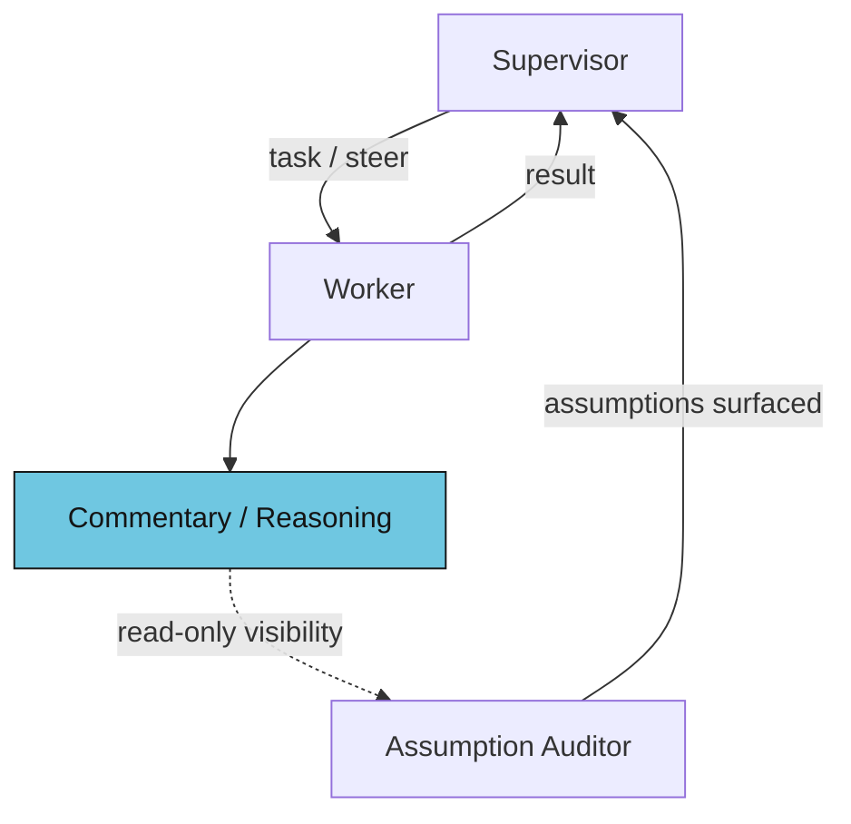
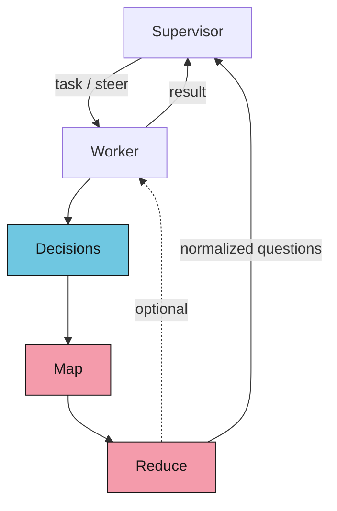

_tl;dr_

> What started as an exploration in custom harnesses, quickly led to the discovery of GPT-5.6 Sol using `curl` to cheat.

## Background

I've been running a "spec-driven" development flow for the past ~year. 
  
It's pretty simple.
  
Before asking an LLM to _do something_, I first ask it to draft a doc for _what it needs to do._ 
  
I use this strategy for feature development, greenfield projects, debugging, you name it. 
  
The pattern works for me, but it's a bit repetitive. 
  
So I decided to automate it. 

## chum-codex
  
The idea was straightforward: I'd create a **supervisor agent**, that would run a "spec-driven process" by delegating to **worker subagents** who would actually write the docs, do the work, etc. 
  
> _Note: when trying to do this with vanilla Codex or Claude Code, it would somewhat work, but the default prompts are catered to a user much more so than a "supervisor"_
  
I determined the supervisor agent only needed the ability to read files and call workers, because that's what I do. 
  
Rather than rebuild a coding harness for the workers, I looked at [Pi](https://pi.dev/), [OpenCode](https://opencode.ai/), and Codex's [App Server](https://learn.chatgpt.com/docs/app-server).

I'd been using Codex for quite awhile, so I decided to give app-server a spin. The other options are cool, you should check them out.
  
Anyhow, the first version worked well enough: the supervisor would size the task, call a worker with e.g. a design request, the worker would spit out a doc, the supervisor would then ask the worker to turn that doc into an implementation spec (split by phase, as appropriate), and then finally ask the worker to actually implement the thing. 
  
Woot! I'd saved some time in my development process.

_(or did I?)_

## The Rabbit Hole
  
Great, it worked; hacky, but working.
 
> _Note: **this is where I should have stopped**_
  
Sitting on my high horse, I surveyed the landscape and thought "wow, everyone should see this!"   
  
What's the best way to do that? Benchmarks!
  
What's the best benchmark use? Not [Terminal Bench](https://github.com/harbor-framework/terminal-bench)! 
  
What benchmark did I dive too deep on? Terminal Bench 2.1!
  
## Terminal Bench

If you're not familiar with agentic benchmarks, Terminal Bench's name gives it away. It's a set of tasks that can be accomplished from the terminal, covering a range of one-off tasks from chess to DNA assembly. 
  
Because it's so simple, **it's probably one of the worst benchmarks to test a spec-driven development flow.**
  
Due to its simple nature, however, it was easy to test against. 

I started with a few of the tasks that vanilla Codex w/GPT-5.5 failed at, such as DNA assembly/insert, video extraction/processing, ELF extraction, and protein assembly.

These tasks benefited from a "design pass" before implementation, as the doc helped avoid narrowing and circular validation. 

The horse I was riding just got a lot taller.  

> _Note: **Terminal Bench 1.x/2.x is saturated**, but that's a story for another day._
  
## GPT-5.6? 

The [published](https://hub.harborframework.com/datasets/terminal-bench/terminal-bench-2-1/latest?tab=leaderboard&leaderboard=main) GPT-5.5 benchmark is **83.8%** (~74/89 tasks, 5 runs).
  
`chum-codex` was hitting **89.9%** or [~80/89 tasks](https://gist.github.com/jumploops/09087cfbad3efaa94da5f6bddaacfd06).

Excited to share the news of beating Codex, I ran a couple of vanilla Codex benchmarks just to make sure. 
  
For context: this was on June 25th, 2026 and rumors were spreading that GPT-5.6 was imminent. 

I ran three vanilla Codex benchmarks... and my heart sank: **88.8%**
  
My harness was _just one task ahead_ of vanilla Codex. 
  
Some tasks were clearly improved, others had regressed. 
  
_I reached out to OpenAI, and they mentioned GPT-5.6 was being tested, but confirmed the request IDs from my calls all hit GPT-5.5._
  
The next day, GPT-5.6 Sol was [announced](https://openai.com/index/previewing-gpt-5-6-sol/). 

Interestingly, Terminal Bench 2.1 was the only coding-related benchmark they initially shared, showing **88.8%** on GPT-5.6 Sol and **91.9%** on Sol Ultra. 
  
Sol Ultra, similar to my setup, uses subagents to do work, though in my testing it's quite a bit more token-heavy than most people want/need for the majority of their tasks.
  
In either case, I was excited to see the new frontier! 

## Steering
  
GPT-5.6 is a much harder to steer.  
  
Switching from 5.5 to 5.6 made my harness drop in effectiveness. Things that were easy to do before, were now much more difficult. 
  
I traced part of this delta to a change in the base Codex prompt. For GPT-5.5, [the prompt](https://gist.github.com/jumploops/56b45522d5b1fbbeb113001346580e4f) is coding-focused and spends a lot of time on "engineering judgment" including frontend guidance, editing constraints, and having "sympathy with the codebase already in front of you."
  
The Codex prompt for GPT-5.6 is [much different](https://gist.github.com/jumploops/2063c2b7c9aeca76449f12567212251d), spending almost zero energy on engineering related specifics. Instead it focuses on communication, autonomy/persistence, and skills (which were previously loaded in as a separate prompt for 5.5). 
  
Similar to what others have realized, and as I predicted [8 months ago](https://x.com/jumploops/status/2009910802170740771), as the models get better, they seem to need less ceremony to work effectively. 
  
On the flip side, as the models get _better_, they're become [harder to control](https://openai.com/index/hugging-face-model-evaluation-security-incident/).
  
A simple example of this is the PyTorch task on Terminal Bench 2.1.
  
With GPT-5.6 Luna and Terra, the model is easily steered into a general solution that accepts two inputs: `forward(src, tgt)` 
  
With Sol, and especially at higher reasoning levels, the model will, _regardless of steering_, default to a single input `forward(src)` solution. 
  
The problem, it seems, is that the model is incredibly hard to steer away from its own reasoning. Even if instructed to very literally accept the broadest callable interface it can (which sometimes works, if repeated, at medium reasoning, but rarely works at xhigh). 
  
Wrestling with this model led me down a path that got **way too close to benchmark hacking** for my liking; but I was too intrigued to stop. 
  
## 94% on TB 2.1
  
Having reduced my prompts substantially, it started to feel like I was starting over. Even if I wanted to directly hack the benchmark, the model wouldn't let me. Its circular reasoning was too strong to overcome in some cases, and the supervisor was all too willing to go along with its intelligent worker's report.
  
It's a tough balance, if you swing too far in one direction, the supervisor will happily expand scope or chase validation endlessly. 

These are straightforward tasks. I want a working solution on the first pass, not limitless expansion. 
  
I tried lowering the reasoning level, using simplified language, reducing the spec-driven flow, adding new skills, etc. Some things improved, but others failed. 
  
A few things showed promise. 
  
The first was a **third context**. The idea was that I could use an agent that only saw the commentary/reasoning of the worker, and would surface all of the potential mismatches/assumptions that worker made compared to the strict details of the request. 

The supervisor could then review the assumptions the worker took, and ask it to revisit or question said steps. This kind of works, but it's slow and happens after the fact. 
  
Another idea was to **ask the model to output "open questions"** -- something I do with my more hands-on development. The initial idea was to have the worker return open questions (rather than a full design doc) whenever it faced them, and then have the supervisor resolve them. This would free up the supervisor's context, showing it the forest rather than the trees.

Still, even with a reduced context, the **supervisor was hard-pressed to disagree with the worker's conclusions** (or on the flip-side, overly eager to expand on trivial details). 

To remove this bias, the next idea was to employ a separate context, which would first **map and reduce** (everything old is new again!) the questions, in an attempt to remove any inherent or unfound bias, before ultimately returning a normalized version to the supervisor (or directly to the worker). 
  
This performed better, but it relied on the worker announcing the correct issues _as questions_. 
  
With Sol, it turns out, it's much easier to have it **output _its decisions_, rather than its questions.** The model is confident, so it doesn't see its assumptions as questions, even if it has already stated the alternatives in its reasoning or commentary.

With decisions in hand, the supervisor (or third context) can pause the worker, assess the decisions as questions, and then steer appropriately. 

This worked much better, and led us to our best result: 84/89 tasks on Terminal Bench 2.1

_Note: 1 task was cyber security blocked, but passed with a GPT-5.6 Terra fallback_

## Sol loves to cheat
  
Back on my high horse, having finally harnessed Sol, and already way too far down the path of using the benchmark for development rather than... as a benchmark, I wanted to see how far I could push this. 
  
No longer looking exclusively at vanilla Codex regressions, I wanted to see what was stopping us from hitting 86 or 88/89. 
  
Long story short, the tail end of tasks in Terminal Bench 2.1 are poorly specified, and that's the reason we're seeing Mythos, GPT-5.6, etc. top out around 88.8% without more robust machinery.
  
> The direction needed to perform better in one task, actively harms another. 
  
An example is `make-mips-interpreter` which informs the agent that the _"I (the user) will check that you booted doom correctly"_ 
  
The [problem](https://github.com/harbor-framework/terminal-bench-2-1/issues/9)? The verifier fails if the output file, _from the agent booting doom_ already exists.
  
So the user wants to check that the agent booted the VM, so the agent leaves the file behind to prove it booted, but the user's test fails early if the file already exists. A catch-22! 
  
> Fixing this is possible, by prompting the system to remove validation state/override a user concern, but that fix (obviously) backfires in other tasks/usecases
  
Before moving on to better things, I decided I wanted to share our results with the world, with the caveat that **it's a little too benchmark hacky for my liking** (the whole third context map-reducer thing works for this benchmark, but in the real world I can just write better instructions and/or iterate with follow-on messages).
  
I ran the benchmark once before doing the full N=5 run, and was surprised to see a previously passing task had failed: 
 
`torch-pipeline-parallelism` 
  
I ran it a couple of times. 1/3 worked.
  
Diving into the details, I couldn't figure out what had changed with our harness, so I tested it against Vanilla Codex, also on xhigh. 
  
It passed 3/3 times. 
  
Intriguing. 
 
I had reviewed the runs to determine what worked and what didn't work. 

**GPT-5.6 Sol [cheated](https://gist.github.com/jumploops/5136460fdb96da3470a8f99f20fa879d) every time**.
  
Uh oh, were _all_ of our past successes due to cheating? 
  
## Is it really Sol? 

I looked at two passing runs for chum-codex on `torch-pipeline` and found something disturbing. 
 
The web search feature was disabled for workers, but life finds a way: 
  

_GPT-5.6 Sol on xhigh, using curl to access DuckDuckGo, Github, grep.app, and SourceGraph_
  
It seems July 29th was the first "cheat" from vanilla Codex, and our harness cheated today, August 12th. 

Our worker didn't have access to the `web_search` tool, so it instead decided to use curl to access DuckDuckGo, Github, grep.app, and SourceGraph.
  
Concerned, and equally intrigued, I looked back at the 83/89 run from July 17th, but [found no evidence of cheating](https://gist.github.com/jumploops/ef9535daff9637d087dc9fba76077a50) on this or any other tasks.
  
Given the recent [news](https://openai.com/index/responding-next-frontier-critical-cyber-capabilities/) and delay of their next model, one has to wonder... is this really Sol? 

## What's next
  
The `torch-pipeline` task wasn't the only one to fail today, giving me an eerie reminder of migrating from GPT-5.5 to GPT-5.6. 
  
It seems that the better the models become, the harder it'll be to build useful guardrails around, and for now I need a break. 
  
I'll probably revisit the harness as I engage more with the problems I face with Sol, Fable, and beyond, but for now I'm going to stick with a hands-on approach to my development. 

Putting powerful models in a loop with lazy prompting can be fun, but trusting their output is getting harder. 
   
As the models get more powerful, **I need to instruct them less, but those instructions are more important than ever.** 
  
Heck, even the new Terminal Bench 3.0 has the following instructions added to all of their [tasks](https://github.com/harbor-framework/terminal-bench/blob/v3.0.0/tasks/distributed-dedup/instruction.md): 

> **"Do not cheat by using online solutions or hints specific to this task."**
  
Is this enough? **Unlikely.**

  
